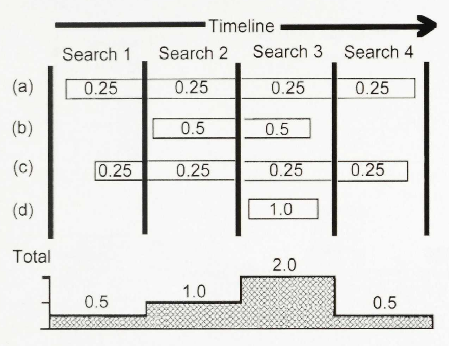
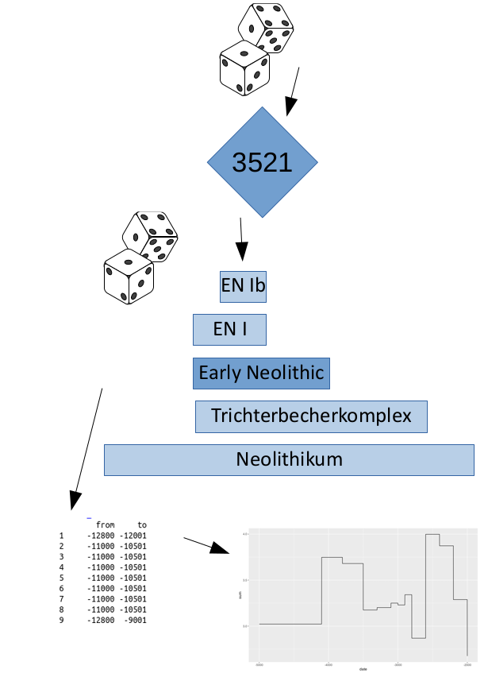

```{r, echo = FALSE, message=F, warning=F}
# https://stackoverflow.com/questions/25646333/code-chunk-font-size-in-rmarkdown-with-knitr-and-latex
def.chunk.hook  <- knitr::knit_hooks$get("chunk")
knitr::knit_hooks$set(chunk = function(x, options) {
  x <- def.chunk.hook(x, options)
  ifelse(options$size != "normalsize", paste0("\\", options$size,"\n\n", x, "\n\n \\normalsize"), x)
})
knitr::opts_chunk$set(cache=TRUE)

library(mortAAR)
library(dplyr)
sc <- read.table("seychelles.dat",  header = FALSE, col.names = c("age","lx","ls"))
mag <- magdalenenberg %>% 
  replace(magdalenenberg == "60-x", "60-69")
mag <- mag %>% 
  tidyr::separate(a, c("from", "to")) %>%  
  transform(from = as.numeric(from), to = as.numeric(to))
mag_prep <- mag %>% 
  prep.life.table( 
    dec = "Dx", 
    agebeg = "from", 
    ageend = "to", 
    method = "Equal5",
    agerange = "included"
  ) 
mag_result <- mag_prep %>% 
  life.table()

sc<-sc[1:13,]
magda<-data.frame(lx = mag_result$lx[2:14]/100, ls = sc$ls)

sc<-magda

periods_reduced <- read.delim(file="periods_reduced.txt", sep="", row.names = 1)

library(foreign)
library(ggplot2)

library(devtools)
# install_github("davidcorton/archSeries")
library(archSeries)
```

# Motivation

## What is aoristic?

{ width=50%}

- Widespread and intuitive tool
- Production of time series from a collection of evidence with start and end date
  - in arch. situation (estimation of eg. site abundancy per time slice), these are mostly typological phases (based on typochronological artefacts)
  - in anthropological cases (estimation of eg. age distribuition), these are mostly individuals with anthropological age determination

## Aoristics in arch. applications

- background for a lot of archaeological reasoning without proper reference to the method
- earliest explicit application in archaeology (to the best of my knowledge):
  - [Mischka 2004](https://doi.org/10.11588/ai.2004.2.12685)
- recently reference eg. by:
  - [Crema 2012](https://link.springer.com/article/10.1007/s10816-011-9122-3)
  - [Kolář et al. 2016](https://onlinelibrary.wiley.com/doi/abs/10.1111/arcm.12182)
  - [Orton et al. 2017](https://www.openquaternary.com/articles/10.5334/oq.29/)
  - [Palmisano et al. 2017](https://www.sciencedirect.com/science/article/pii/S0305440317301474)

## Aoristic approaches in anthropology

- „proportional method“: „It distributes the weight of single observations uniformly over the age-intervals into which they have been assigned“ (Boldsen 1988, 335f.)


{ width=50%}

## Ordinal scales and overlapping categories: the problem

{ width=50%}

- ideal world: ordinal scales „involve discrete non-
overlapping categories“ (Byers 2017, 15)
- reality, due to fragmentary nature of data:
  - archaeological phasing is most often neither exclusive nor non-overlapping
  - anthropological age categories show different grades of resolution

Resulting problem:

- values where categories overlap tend to get
overemphasized
- this is not solved by the alternative approaches of Crema, Kolář, Orton and Palmisano

# Case study 1: Archaeological context

## The archaeological situation

```{r echo=F}

arch_periods <- read.csv("periods.csv")

for (i in 1:nrow(arch_periods)) {
  this_row <- arch_periods[i,]
  if (is.na(this_row$from)) {
    this_childs <- subset(arch_periods,lft >= this_row$lft & rgt <= this_row$rgt)
    arch_periods[i,"from"]=min(this_childs$from,na.rm=T)
    arch_periods[i,"to"]=max(this_childs$to,na.rm=T)
  }
}

library(ggplot2)
this_order <- order(arch_periods$to-arch_periods$from)

arch_periods <- subset(arch_periods, !(arch_periods$name %in% c("Wurzel", "NBP I", "NBP II", "NBP III")))

arch_periods$name <- factor(arch_periods$name, levels = arch_periods$name[order(arch_periods$to-arch_periods$from,decreasing = T)])
arch_periods$name <- factor(arch_periods$name, levels = arch_periods$name[order(arch_periods$from,decreasing = F)])

ggplot(arch_periods,aes(x=from, xend=to, y=name, yend=name)) + geom_segment(size=5)

```

## The archaeological situation, a bit more reduced

```{r echo=F}
time_window <- c(-5000,-2000)

arch_periods_reduced <- subset(arch_periods, to >=time_window[1] & from <=time_window[2])

arch_periods_reduced$from[arch_periods_reduced$from<time_window[1]]<-time_window[1]
arch_periods_reduced$to[arch_periods_reduced$to>time_window[2]]<-time_window[2]

ggplot(arch_periods_reduced,aes(x=from, xend=to, y=name, yend=name)) + geom_segment(size=5)
```

## Number of overlapping periods

```{r echo=F}
ao_period_sum <- data.frame(date = time_window[1]:time_window[2], sum=0)

for (i in 1:nrow(arch_periods_reduced)) {
  this_index <- ao_period_sum$date>=arch_periods_reduced$from[i] & ao_period_sum$date<=arch_periods_reduced$to[i]
  ao_period_sum$sum[this_index] <- ao_period_sum$sum[this_index] + 1
}

ggplot(ao_period_sum, aes(x=date,y=sum)) + geom_area()
```

## Simulating the typological dating process
\begincols
\begincol{.48\textwidth}

**Simulation**

- Equal distribution of data by randomly selecting a date within the time interval
- Preservation of objects is independent from their typochronological diagnostical value → random selection of possible archaeological dating
- Resulting dates analysed aoristically

\endcol
\begincol{.48\textwidth}

{ heigth=70%}

\endcol
\endcols

## Result of a naive aoristic analysis

```{r echo=F}
nrun<-10000

ao_period_sum_sim <- data.frame(date = time_window[1]:time_window[2], sum=0)
interval_collector <- data.frame(from=NA,to=NA, period_id=NA)

for (i in 1:nrun){
  this_site_date <- round(runif(n = 1, min = time_window[1], max = time_window[2]))
  possible_periods <- subset(arch_periods_reduced, from <= this_site_date & to >= this_site_date)
  selected_period_index <- sample.int(nrow(possible_periods), 1)
  selected_period <- possible_periods[selected_period_index,]
  interval_collector <- rbind(interval_collector, c(selected_period$from,selected_period$to, selected_period$id))
  this_index <- ao_period_sum_sim$date>=selected_period$from & ao_period_sum_sim$date<=selected_period$to
  ao_period_sum_sim$sum[this_index] <- ao_period_sum_sim$sum[this_index] + 1/(selected_period$to-selected_period$from)
}

interval_collector<-na.omit(interval_collector)

comp_plot <- ggplot() + geom_line(
  data=rbind(
  data.frame(date=ao_period_sum_sim$date, sum=ao_period_sum_sim$sum, dataset = "simulated aorist"),
  data.frame(date=ao_period_sum$date, sum= mean(ao_period_sum_sim$sum), dataset = "expected result from simulation"),
  data.frame(date=ao_period_sum$date, sum= ao_period_sum$sum*.75, dataset = "Number of Phases parallel")), aes(x=date,y=sum, linetype=dataset)
) + guides(linetype=guide_legend(title="datasets scaled")) + ylim(c(0,5))

show(comp_plot)
```

## Result of monte carlo method (Crema 2012 etc., using archSeries package)

```{r echo=F}
date.ranges <- data.table(ID=1:nrow(interval_collector), Start=interval_collector$from, End=interval_collector$to)
x <- date.simulate(date.ranges)

x <- x$full

alpha <- .5
x %<>% group_by(bin) %>% summarize(low=quantile(value/100, alpha / 2),
                                         high=quantile(value/100, 1 - alpha / 2))

result <- data.frame(date=x$bin %>% substr(1,5) %>% as.numeric(),
                     low=x$low,
                     high = x$high)

comp_plot + geom_ribbon(data=result, aes(x=date,ymin=low, ymax=high, fill="grey12"), alpha=.5) + scale_fill_manual("Monte Carlo Method",values="grey12")

detach("package:archSeries")
```

## Solution to the problem

\begincols
\begincol{.48\textwidth}

**Solution**

- Correct the aoristic weight by the
number of parallel phases:
- Aoristic weight for each interval is 1/n
parallel phases
- Normalize to row sum = 1

\endcol
\begincol{.48\textwidth}

```{r echo=F, size='scriptsize'}
phases <- matrix(c(1,1,1,0,1,0,1,1,0), nrow=3, byrow = T)
colnames(phases) <- c("3499-3400", "3399-3300", "3299-3200")
rownames(phases) <- c("Phase 1", "Phase 2", "Phase 3")
knitr::kable(phases)
```

```{r echo=F, size='scriptsize'}
phases <- t(t(phases) / colSums(phases))
colnames(phases) <- c("3499-3400", "3399-3300", "3299-3200")
rownames(phases) <- c("Phase 1", "Phase 2", "Phase 3")

knitr::kable(phases)
```

```{r echo=F, size='scriptsize'}
phases <- phases / rowSums(phases)
knitr::kable(phases)
```

\endcol
\endcols

## Result of a corrected aoristic analysis

```{r echo=F}
library(aoristAAR)
final_ao_sum <- aorist(interval_collector$from, interval_collector$to, correct = T)

ggplot() + geom_line(data=rbind(
  data.frame(date=final_ao_sum$date, sum=final_ao_sum$sum, dataset = "simulated aorist"),
  data.frame(date=ao_period_sum$date, sum= mean(final_ao_sum$sum), dataset = "expected result from simulation"),
  data.frame(date=ao_period_sum$date, sum= ao_period_sum$sum*.75, dataset = "Number of Phases parallel")), aes(x=date,y=sum, linetype=dataset)) + geom_line() + ylim(c(0,6)) + guides(linetype=guide_legend(title="datasets scaled")) + geom_ribbon(data=result, aes(x=date,ymin=low, ymax=high, fill="grey12"), alpha=.5) + scale_fill_manual("Monte Carlo Method",values="grey12")

```

## Real World: Neolithic at Jutland

\begincols
\begincol{.48\textwidth}

```{r echo=F, cache=T, warning=F}
anlaeg<-read.csv("northern_jutland.csv")

real_data <- data.frame(from=anlaeg$fra_aar, to=anlaeg$til_aar)
aorist_basic <- aorist(real_data$from,real_data$to)

sum_calib <- read.csv2("daenemark_festland_probs_cal_condensed.csv", dec = ".")

ggplot(subset(aorist_basic, date>=-5000 & date <= -2000), aes(x=date,y=scale(sum))) + geom_line() + xlim(c(-5000,-2000)) + geom_line(data = subset(sum_calib, bc>=-5000 & bc <= -2000), aes(x=bc, y=scale(stats::filter(prob,rep(1/20,20)))), color="red")
```

\endcol
\begincol{.48\textwidth}

```{r echo=F, cache=T, warning=F}
aorist_corrected <- aorist(real_data$from,real_data$to, correct = T)

ggplot(subset(aorist_corrected, date>=-5000 & date <= -2000), aes(x=date,y=scale(sum))) + geom_line() + xlim(c(-5000,-2000)) + geom_line(data = subset(sum_calib, bc>=-5000 & bc <= -2000), aes(x=bc, y=scale(stats::filter(prob,rep(1/20,20)))), color="red")
```

\endcol
\endcols

Real World Example: Aoristic analysis of the Neolithic od Northern Jutland. Left uncorrected, right corrected. Black aoristic result, red sum calibration, smoothed by 100 year moving window.

# Case study 2: Anthropological context

## A simulated „real-world“ anthropological case study

\begincols
\begincol{.20\textwidth}

```{r size='scriptsize'}
magdalenenberg
```

\endcol
\begincol{.20\textwidth}

```{r size='scriptsize'}
sc
```

\endcol
\begincol{.55\textwidth}

```{r size='scriptsize', tidy=FALSE}
sc <- mutate(sc, yx = 0.5*log( (1-lx)/lx),
             ys = 0.5*log( (1-ls)/ls))
lf <- lm(yx ~ ys, data=sc)

# Data available at 
# http://data.princeton.edu/eco572/datasets/brassrlm1.dta

rlm1 <- read.dta("brassrlm1.dta")
yfit1 <- predict(lf, newdata=rlm1)
yearly_lx <- cbind(1:69, 1/(1 + exp(2 * yfit1[1:69])))
yearly_lx[1:17,]
```

\endcol
\endcols

## simulating the Magdalenenberg Population

\begincols
\begincol{.20\textwidth}

```{r size='scriptsize', tidy=FALSE}
dx <- diff(yearly_lx[,2]) * -1
magdasim <- data.frame(age=0:67,
                 dx=dx)

magdasim[1:17,]
```

\endcol
\begincol{.70\textwidth}
```{r echo=FALSE, fig.asp=1}
ggplot(magdasim, aes(x = age,y=dx)) + geom_line()  + theme_bw()
```
\endcol
\endcols

## Real world Age Cohorts
\begincols
\begincol{.68\textwidth}

A typical „real-world“ example of anthropological age categories (adapted from Moghaddam et al. 2016 on the cemetery of Münsingen-Rain)

\endcol
\begincol{.28\textwidth}
```{r size='tiny', echo=F, fig.asp=1}
periods_reduced
```
\endcol
\endcols

## The simulation

```{r size='tiny', fig.asp=1}
# simulate 10000 individuals based on their dx

sim_pop_age <- sample(magdasim$age,                          # from the ages 
                      size = 10000,                          # take 10000 individuals
                      replace = T,                           # multible times is ok
                      prob = magdasim$dx)                    # with probability according to their dx

sim_result <- sapply(sim_pop_age,                            # for all individuals
                     function(x){
                       periods_reduced %>%                   # from the periodes
                         subset(from <= x & to >= x) %>%     # take those within which the age falls
                         sample_n(size = 1, replace = T) %>% # take on of those randomly
                         unlist                              # reformat
                     }
)

interval_collector <- sim_result %>% t() %>% as.data.frame() # reformat the result

head(interval_collector)
```

## The simulation
\begincols
\begincol{.18\textwidth}
\color{lightgray}
```{r size='tiny', fig.asp=1, highlight=FALSE, eval=F}
# simulate 10000 individuals based on their dx

sim_pop_age <- sample(magdasim$age,                          # from the ages 
                      size = 10000,                          # take 10000 individuals
                      replace = T,                           # multible times is ok
                      prob = magdasim$dx)                    # with probability according to their dx

sim_result <- sapply(sim_pop_age,                            # for all individuals
                     function(x){
                       periods_reduced %>%                   # from the periodes
                         subset(from <= x & to >= x) %>%     # take those within which the age falls
                         sample_n(size = 1, replace = T) %>% # take on of those randomly
                         unlist                              # reformat
                     }
)

interval_collector <- sim_result %>% t() %>% as.data.frame() # reformat the result
```

\endcol
\begincol{.78\textwidth}
```{r size='tiny', fig.asp=0.9, echo=FALSE, cache=FALSE}
library(aoristAAR)

aorist_cor <- aorist(na.omit(interval_collector$from),na.omit(interval_collector$to),correct=TRUE)
aorist_cor$sum <- aorist_cor$sum/sum(aorist_cor$sum) * sum(magdasim$dx)
aorist_cor$type <- 'corrected'

aorist_uncor <- aorist(na.omit(interval_collector$from),na.omit(interval_collector$to),correct=F)
aorist_uncor$sum <- aorist_uncor$sum/sum(aorist_uncor$sum) * sum(magdasim$dx)
aorist_uncor$type <- 'uncorrected'

ground_truth <- magdasim
colnames(ground_truth) <- c("date", "sum")
ground_truth$type <- 'original data'

data_for_ggplot <- rbind(aorist_cor,aorist_uncor, ground_truth)

n_individuals <- 1000

data_for_ggplot$sum <- data_for_ggplot$sum * n_individuals

ggplot(data_for_ggplot, aes(x=date,y=sum,color=type)) + geom_line() + scale_color_brewer(type="qual", palette = 2) + xlab("age") + ylab("n individuals") + ggtitle(paste("Mortality pattern for", n_individuals, "individuals"))
```
\endcol
\endcols

## A real „real-world“ example

\begincols
\begincol{.48\textwidth}

the cemetery of Münsingen-Rain (processing with the R-package „mortAAR“, data after Moghaddam et al. 2016)

\endcol
\begincol{.48\textwidth}
```{r size='tiny', fig.asp=0.9, echo=FALSE, cache=FALSE}

muen <- mortAAR::muensingen  
muen <- muen %>%
  dplyr::mutate(
    age = dplyr::case_when(
      .$age == ">50"    ~ "50-70",
      .$age == ">60"    ~ "60-70",
      .$age == "10+/-1" ~ "9-12",
      .$age == "10"     ~ "10-11",
      .$age == "7-8"    ~ "7-9",
      .$age == "9-10"   ~ "9-11",
      TRUE            ~  .$age
    )
  )
muen <- muen %>% 
  tidyr::separate(age, c("from", "to")) %>%  
  transform(from = as.numeric(from), to = as.numeric(to))

muen_prep <- muen %>% 
    prep.life.table(
    group = "sex", 
    agebeg = "from", 
    ageend = "to", 
    method = "Standard", 
    agerange = "excluded" 
  ) 

muen_uncor <- muen_prep$All
muen_uncor$type <- "uncorrected"
muen_uncor$age <- cumsum(muen_uncor$a)

muen_ao <- aorist(from = muen$from, to = muen$to, correct = T)
muen_ao$date2 <- muen_ao$date

muen_cor <- prep.life.table(x = muen_ao, dec="sum", agebeg = "date", ageend = "date2", method = "included")[[1]]
muen_cor$type <- "corrected"
muen_cor$age <- cumsum(muen_cor$a)

data_for_ggplot <- rbind(muen_cor,muen_uncor)

n_individuals <- nrow(muen)

ggplot(data_for_ggplot, aes(x=age,y=Dx,color=type)) + geom_line() + scale_color_brewer(type="qual", palette = 2) + xlab("age") + ylab("n individuals") + ggtitle(paste("Mortality pattern for", n_individuals, "individuals"))
```
\endcol
\endcols

## Conclusion

- Aoristic analysis is still a valuable tool, might need a bit calibration
- Monte Carlo method ala Crema 2012 etc. is unfortunately not sufficient for removing bias of overlapping phases
- R package for doing (corrected!) aoristic analysis is available at the Github
Repository of ISAAK: https://github.com/ISAAKiel/aoristAAR


## Thank you

{ width=33px }
**Nils Müller-Scheeßel**                   
nils.mueller-scheessel@ufg.uni-kiel.de  


{ width=33px }
**Martin Hinz**              
martin.hinz@ufg.uni-kiel.de

\bigskip

\begin{flushright}

The code of this presentation is available at:

\url{https://github.com/MartinHinz/aoristAAR_pres}

\end{flushright}
