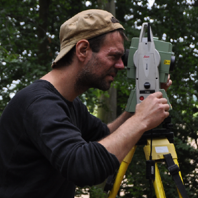

```{r, echo = FALSE, message=F, warning=F}
# https://stackoverflow.com/questions/25646333/code-chunk-font-size-in-rmarkdown-with-knitr-and-latex
def.chunk.hook  <- knitr::knit_hooks$get("chunk")
knitr::knit_hooks$set(chunk = function(x, options) {
  x <- def.chunk.hook(x, options)
  ifelse(options$size != "normalsize", paste0("\\", options$size,"\n\n", x, "\n\n \\normalsize"), x)
})
knitr::opts_chunk$set(cache=TRUE)

library(mortAAR)
library(dplyr)
sc <- read.table("http://data.princeton.edu/eco572/datasets/seychelles.dat",  header = FALSE, col.names = c("age","lx","ls"))
mag <- magdalenenberg %>% 
  replace(magdalenenberg == "60-x", "60-69")
mag <- mag %>% 
  tidyr::separate(a, c("from", "to")) %>%  
  transform(from = as.numeric(from), to = as.numeric(to))
mag_prep <- mag %>% 
  prep.life.table( 
    dec = "Dx", 
    agebeg = "from", 
    ageend = "to", 
    method = "Equal5",
    agerange = "included"
  ) 
mag_result <- mag_prep %>% 
  life.table()

sc<-sc[1:13,]
magda<-data.frame(lx = mag_result$lx[2:14]/100, ls = sc$ls)

sc<-magda

periods_reduced <- read.delim(file="periods_reduced.txt", sep="", row.names = 1)

library(foreign)
library(ggplot2)
```

# Motivation

## Ordinal scales and overlapping categories: the problem

- ideal world: ordinal scales „involve discrete non-
overlapping categories“ (Byers 2017, 15)
- reality, due to fragmentary nature of data:
  - archaeological phasing is most often neither exclusive nor non-overlapping
  - anthropological age categories show different grades of resolution

## Aoristic approaches in archaeology and anthropology

- „proportional method“: „It distributes the weight of single observations uniformly over the age-intervals into which they have been assigned“ (Boldsen 1988, 335f.)


{ width=50%}

Resulting problem:

- values where categories overlap tend to get
overemphasized

## A simulated „real-world“ anthropological case study

\begincols
\begincol{.20\textwidth}

```{r size='scriptsize'}
magdalenenberg
```

\endcol
\begincol{.20\textwidth}

```{r size='scriptsize'}
sc
```

\endcol
\begincol{.55\textwidth}

```{r size='scriptsize', tidy=FALSE}
sc <- mutate(sc, yx = 0.5*log( (1-lx)/lx),
             ys = 0.5*log( (1-ls)/ls))
lf <- lm(yx ~ ys, data=sc)

rlm1 <- read.dta(
"http://data.princeton.edu/eco572/datasets/brassrlm1.dta")
yfit1 <- predict(lf, newdata=rlm1)
yearly_lx <- cbind(1:69, 1/(1 + exp(2 * yfit1[1:69])))
yearly_lx[1:17,]
```

\endcol
\endcols

## simulating the Magdalenenberg Population

\begincols
\begincol{.20\textwidth}

```{r size='scriptsize', tidy=FALSE}
dx <- diff(yearly_lx[,2]) * -1
magdasim <- data.frame(age=0:67,
                 dx=dx)

magdasim[1:17,]
```

\endcol
\begincol{.70\textwidth}
```{r echo=FALSE, fig.asp=1}
ggplot(magdasim, aes(x = age,y=dx)) + geom_line()  + theme_bw()
```
\endcol
\endcols

## Real world Age Cohorts
\begincols
\begincol{.68\textwidth}

A typical „real-world“ example of anthropological age categories (adapted from Moghaddam et al. 2016 on the cemetery of Münsingen-Rain)

\endcol
\begincol{.28\textwidth}
```{r size='tiny', echo=F, fig.asp=1}
periods_reduced
```
\endcol
\endcols

## The simulation

```{r size='tiny', fig.asp=1}
# simulate 10000 individuals based on their dx

sim_pop_age <- sample(magdasim$age,                          # from the ages 
                      size = 10000,                          # take 10000 individuals
                      replace = T,                           # multible times is ok
                      prob = magdasim$dx)                    # with probability according to their dx

sim_result <- sapply(sim_pop_age,                            # for all individuals
                     function(x){
                       periods_reduced %>%                   # from the periodes
                         subset(from <= x & to >= x) %>%     # take those within which the age falls
                         sample_n(size = 1, replace = T) %>% # take on of those randomly
                         unlist                              # reformat
                     }
)

interval_collector <- sim_result %>% t() %>% as.data.frame() # reformat the result
```

## The simulation
\begincols
\begincol{.18\textwidth}
\color{lightgray}
```{r size='tiny', fig.asp=1, highlight=FALSE, eval=F}
# simulate 10000 individuals based on their dx

sim_pop_age <- sample(magdasim$age,                          # from the ages 
                      size = 10000,                          # take 10000 individuals
                      replace = T,                           # multible times is ok
                      prob = magdasim$dx)                    # with probability according to their dx

sim_result <- sapply(sim_pop_age,                            # for all individuals
                     function(x){
                       periods_reduced %>%                   # from the periodes
                         subset(from <= x & to >= x) %>%     # take those within which the age falls
                         sample_n(size = 1, replace = T) %>% # take on of those randomly
                         unlist                              # reformat
                     }
)

interval_collector <- sim_result %>% t() %>% as.data.frame() # reformat the result
```

\endcol
\begincol{.78\textwidth}
```{r size='tiny', fig.asp=0.9, echo=FALSE, cache=FALSE}
library(aoristAAR)

aorist_cor <- aorist(na.omit(interval_collector$from),na.omit(interval_collector$to),correct=TRUE)
aorist_cor$sum <- aorist_cor$sum/sum(aorist_cor$sum) * sum(magdasim$dx)
aorist_cor$type <- 'corrected'

aorist_uncor <- aorist(na.omit(interval_collector$from),na.omit(interval_collector$to),correct=F)
aorist_uncor$sum <- aorist_uncor$sum/sum(aorist_uncor$sum) * sum(magdasim$dx)
aorist_uncor$type <- 'uncorrected'

ground_truth <- magdasim
colnames(ground_truth) <- c("date", "sum")
ground_truth$type <- 'original data'

data_for_ggplot <- rbind(aorist_cor,aorist_uncor, ground_truth)

n_individuals <- 1000

data_for_ggplot$sum <- data_for_ggplot$sum * n_individuals

ggplot(data_for_ggplot, aes(x=date,y=sum,color=type)) + geom_line() + scale_color_brewer(type="qual", palette = 2) + xlab("age") + ylab("n individuals") + ggtitle(paste("Mortality pattern for", n_individuals, "individuals"))
```
\endcol
\endcols

## A real „real-world“ example

\begincols
\begincol{.48\textwidth}

the cemetery of Münsingen-Rain (processing with the R-package „mortAAR“, data after Moghaddam et al. 2016)

\endcol
\begincol{.48\textwidth}
```{r size='tiny', fig.asp=0.9, echo=FALSE, cache=FALSE}

muen <- mortAAR::muensingen  
muen <- muen %>%
  dplyr::mutate(
    age = dplyr::case_when(
      .$age == ">50"    ~ "50-70",
      .$age == ">60"    ~ "60-70",
      .$age == "10+/-1" ~ "9-12",
      .$age == "10"     ~ "10-11",
      .$age == "7-8"    ~ "7-9",
      .$age == "9-10"   ~ "9-11",
      TRUE            ~  .$age
    )
  )
muen <- muen %>% 
  tidyr::separate(age, c("from", "to")) %>%  
  transform(from = as.numeric(from), to = as.numeric(to))

muen_prep <- muen %>% 
    prep.life.table(
    group = "sex", 
    agebeg = "from", 
    ageend = "to", 
    method = "Standard", 
    agerange = "excluded" 
  ) 

muen_uncor <- muen_prep$All
muen_uncor$type <- "uncorrected"
muen_uncor$age <- cumsum(muen_uncor$a)

muen_ao <- aorist(from = muen$from, to = muen$to, correct = T)
muen_ao$date2 <- muen_ao$date

muen_cor <- prep.life.table(x = muen_ao, dec="sum", agebeg = "date", ageend = "date2", method = "included")[[1]]
muen_cor$type <- "corrected"
muen_cor$age <- cumsum(muen_cor$a)

data_for_ggplot <- rbind(muen_cor,muen_uncor)

n_individuals <- nrow(muen)

ggplot(data_for_ggplot, aes(x=age,y=Dx,color=type)) + geom_line() + scale_color_brewer(type="qual", palette = 2) + xlab("age") + ylab("n individuals") + ggtitle(paste("Mortality pattern for", n_individuals, "individuals"))
```
\endcol
\endcols


## Background and history of Aoristics

Hallo Welt

## Aoristic as paleodemographic tool

## Aoristic in anthropological contexts

## Problem with overlapping Classification

# Simulation

## Simulating demographic development

## Simulating anthropological populations

# Case Studies

## Case Study One

### The aoristic analysis of the Neolithic of Jutland

## Case Study Two

### The aoristic analysis of ... [Nils]

## Thank you

{ width=33px }
**Nils Müller-Scheeßel**                   
nils.mueller-scheessel@ufg.uni-kiel.de  


{ width=33px }
**Martin Hinz**              
martin.hinz@ufg.uni-kiel.de
